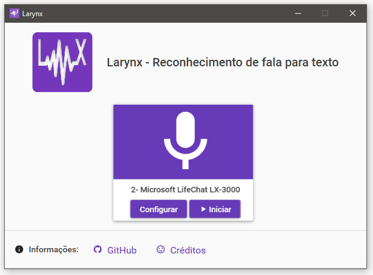
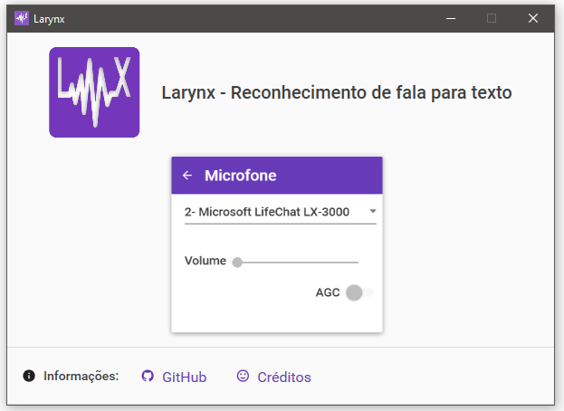

<div align="center">
  
</div>

# Larynx - reconhecimento de fala para texto
**Larynx** é um programa desenvolvido para ajudar pessoas que têm dificuldades em digitar, mas têm facilidade de utilizar a fala para se comunicar. Casos de pessoas que possuem __doenças degenerativas que limitam o movimento__ e sua qualidade de vida.

## 😃 Inspirações
Diversos aplicativos não permitem diretamente que o usuário grave um áudio, por exemplo o Discord, isso faz com que essas pessoas recorram a *softwares* como teclado virtual. Infelizmente digitar nessas ferramentas é um processo lento e para o idioma Português (Brasil) ainda apresenta muitas falhas pelo reconhecimento de fala nativo do Windows.

Diante desse problema nasceu a ideia de desenvolver um *software* que ajude pessoas nesses aplicativos.

## ⚙️ Funcionamento atual
O **Larynx** encontra-se em __desenvolvimento inicial__, porém já funcional, apesar de conter alguns bugs. Foi totalmente desenvolvido com **C#** e **WPF** para interface de usuário. Atualmente é utilizado os servidores do Google com o serviço Speech-to-Text com uma chave pública do Chrome.

O microfone é utilizado para enviar em tempo real ao Google o áudio gravado e retornando a transcrição em texto. Essa transcrição é enviada ao sistema operacional para que digite o texto como se tivesse sido digitado em um teclado, então há sua compatibilidade com diversos aplicativos por essa razão. 

#### Dependências
- Google Speech to Text API
- gRPC
- CUETools Flake
- InputSimulator

## ✍️ Utilização
O uso do aplicativo é bem simples, ao iniciar o programa ```Larynx.exe``` já será exibido um microfone padrão e então só clicar em ```Iniciar```. Após isso, tudo o que for falado no microfone será transcrito para texto.



Caso queira utilizar outro microfone, basta clicar em ```Configurar``` e selecionar o microfone desejado. As opções ```Volume``` e ```AGC``` ainda não são suportadas diretamente pelo aplicativo, sendo necessário acessá-las diretamente pelo __Painel de Controle de Som do Windows__.



### Palavras-chaves para pontuação
O **Larynx** suporta o uso de palavras-chaves para substituir por pontuações da língua portuguesa. Exemplo, caso o usuário diga ```vírgula``` no texto será substituído por ```,```. Isso vale para as palavras abaixo:
- ```vírgula``` por ```,```
- ```ponto``` por ```.```
- ```interrogação``` por ```?```
- ```dois pontos``` por ```:```
- ```ponto e vírgula``` por ```;```
- ```exclamação``` por ```!```
- ```hífen``` por ```-```
- ```nova linha``` por ```\n``` (uma quebra de linha)
- ```abre parêtenses``` por ```(```
- ```fecha parêtenses``` por ```)```

Qualquer erro que ocorra será exibido uma mensagem na tela do programa.

## 💡 Funcionalidades futuras
- Suporte à codificação FLAC, diminuindo a banda necessária e latência.
- Atalhos diretamente por voz como aumentar/diminuir volume e outros.
- Definir teclas de atalho que permitam ligar ou desligar a transcrição da fala.
- Melhorar interface de usuário.
- Melhorar o uso de MVVM no código.
- Corrigir bug de raramente palavras não terem espaço entre elas.
- Auto-updater
- Opções de aumentar/diminuir o volume do microfone na aba de configurações
- Opção de habilitar/desabilitar o AGC, caso o microfone suporte.
- Possibilitar o usuário importar uma chave JSON caso queira utilizar serviços pagos do próprio Google Cloud para o Speech-to-Text.
- Avaliar a possibilidade do processamento ser feito *offline* via inteligência artificial.
- Suporte a outros idiomas além de pt-BR.

## 🐞 Problemas, erros e *bugs*
Como mencionado, o programa encontra-se em uma __fase inicial__ de desenvolvimento e, portanto, são esperados que erros aconteçam. Para isso é encorajado que essas questões sejam publicadas na aba **Issues** junto com os *logs*. Os arquivos de *logs* podem ser encontrados em uma pasta ```logs``` junto ao programa, dentro dela os arquivos são gerados por datas com extensão ```.log```.

## Créditos
[@Metalus](https://github.com/Metalus), Odysseus, [@maxwbot](https://github.com/maxwbot)
#### 👍 Agradecimentos
Mr.Terminal, [@chiyoku](https://github.com/chiyoku), codando, [@alvarofilho](https://github.com/alvarofilho)